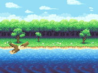
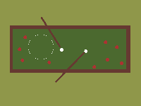
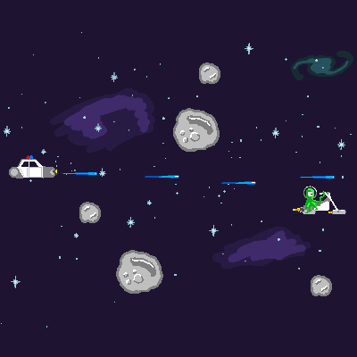

+++
title = "Asteroid Chase - Pyweek, Season 31"
date = 2021-04-15
description = "I really like Python and games. To combine these two passions, I parcitipate in PyWeeks. This event is very special to me because no matter what theme people choose, no matter what framework your game is written in, Python is always present."
path = "pyweek31-asteroid-chase"
[taxonomies]
categories=["blog"]
tags=["python", "gamejam"]
[extra]
feature_image = "asteroid.png"
+++
## Introduction
I really like Python and games. 
To combine these two passions, I parcitipate in PyWeeks. 
This event is very special to me because no matter what theme people choose, no matter what framework your game 
is written in, Python is always present.
### What is this PyWeek about?
First, you need to register a team or individual entry. Then comes one week of voting. People choose from 5
themes and there is always a surprise that yours top1 did not win. After that one week for coding and two for
playing and reviewing games. That's my favorite part. I create custom trophies for other entries, because I like
the idea that everyone who finished his game deserve for a reward.

## The beginning
Before voting is complete, your task is to create an entry with a static URL. At this point, you have no idea what
will be your game about. That's why I created [uniqueentryname](https://pyweek.org/e/uniqueentryname/).
This year, I turned on the option that people could join my team and surprisingly, mit-mit joined my team.  So what's 
the deal? You might think. No deal until I saw his [profile page](https://pyweek.org/u/mit-mit/). 
Damn, what's a huge experience! 13 PyWeek gameJams in a row and games were not ugly, not buggy. 
They were smart, finished and high rated. Damn!

Once he joined my team we started to think what we want our game to be about. Themes were not that great this year.
I prepared, prototypes (in [asesprite](https://www.aseprite.org/)) of games I wanted to develop for most themes. I really 
believed at that time that "bridging the gaps" will win as a theme. I wanted to make a "running game" on a base of 
[Kid Francescoli - "Moon"](https://youtu.be/fdixQDPA2h0) videoclip. Like some dude run and you have to help him by 
filling gaps in front of him on time. But yeah, I mentioned that top 1 theme never wins. Do guess what, Cops win. Our
number 5. We didn't have even idea for that game... 

 

## Cops
Mit-mit was like a fish in a sea. We made a 0-hour meeting. For me it was 1am, for him 11am, as we are from 
different timezones. Double-Mit had the idea. Space chase. Left-to-right chase game with 
[pyMunk](http://www.pymunk.org/en/latest/) as a physic game engine. Soon he came with first art:

So I started to look for inspiration. 
[Mini-map defender](https://arcade.academy/examples/mini_map_defender.html#mini-map-defender) tutorial looked perfect, 
as a starting point. Soon it turned out that the choice of the ready code will only slow us down, as we only discovered 
new bugs in framework.

## Development stack
- planning: [trello](https://trello.com) 
- communication: [discord](https://discord.com/)
- animations: [asesprite](https://www.aseprite.org/)
- music: [musicscore](https://musescore.com/), [audacity](https://www.audacityteam.org/) mit-mit exclusively
- physics engine: [Pymunk](http://www.pymunk.org/en/latest/)
- game engines: [Python Arcade Library](https://arcade.academy/), [Pygame](https://www.pygame.org)

So starting from the top. Trello is a great tool. For this project, unfortunately,  it didn't work as expected. 
It's great to have kanban in case of personal projects or groups projects, but in case of two persons
discord is enough.

For animations I used battle-tested Asesprite and for music mit-mit used MusicScore + Audacity.
So why do we have two engines here instead of single one? Due to errors, we were unable to play many laser sounds 
simulatanisly on Ubuntu + method responsible for pausing the music did not work 
[issue#839](https://github.com/pythonarcade/arcade/issues/839). That's why we used pygame as a sound engine for our 
game.

## Asteroid Chase
You play as Jake. He is a police officer from the Outer Ring, 
which has just arrived in the capital to repair his rusty police ship. 
His plans change when he hears about a grand theft on the police radio. 
Help him catch the thieves of the imperial crown!

The plans were huge. Inventory, weapons, cutscenes, non-linear plot ... yeah. I had the idea to draw the parts of the 
crown one by one to reward the player on the end of each level. The player had to shoot the enemies, and when their 
shield dropped to zero, the player could arrest enemies later on. Unfortunately one week is very short period of time. 
Taking it into account, plus things that we gave up, we really managed to create a full-fledged game.

We invite you to [download](https://github.com/bitStudioDev/PyWeek31-Asteroid-Chase) and play the game and watch the gameplay on YouTube. Every star and like counts. 
We'd be grateful if you rated the game as we think it's really fun.

## Watch game on YouTube

<iframe width="560" height="315" src="https://www.youtube.com/embed/b31-toqAYNI" title="YouTube video player" frameborder="0" allow="accelerometer; autoplay; clipboard-write; encrypted-media; gyroscope; picture-in-picture" allowfullscreen></iframe>
